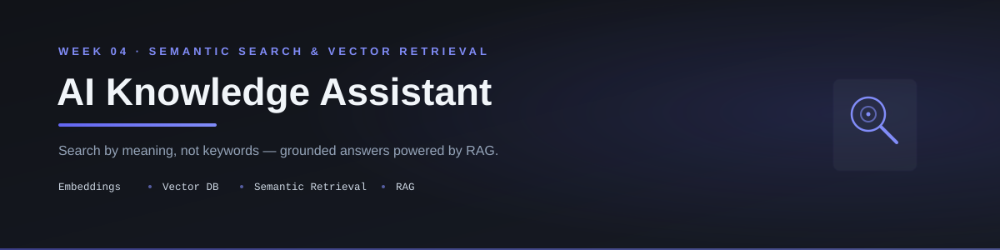

<p align="center">
  
</p>

<p align="center">
  
  
  
  
  
  
  
</p>

<p align="center">
  Search your documents by meaning, not keywords — powered by embeddings, a vector database, and a full RAG pipeline.<br/>
  Fourth deliverable of a <b>90-day AI Engineering roadmap</b> (Phase 1: Foundation, Week 4).
</p>

---

## 📑 Table of Contents

- [Overview](#-overview)
- [Features](#-features)
- [Demo](#-demo)
- [Installation](#️-installation)
- [How to Run](#️-how-to-run)
- [Architecture](#️-architecture)
- [Why Semantic Search](#-why-semantic-search)
- [Folder Structure](#-folder-structure)
- [Future Improvements](#-future-improvements)
- [Roadmap Context](#-roadmap-context)
- [Author](#-author)
- [License](#-license)

---

## 📖 Overview

**AI Knowledge Assistant** replaces Week 3's basic keyword-matching context selection with real **semantic search**: documents are converted into embeddings (numeric vectors capturing meaning), stored in a vector database (ChromaDB), and retrieved based on *meaning similarity* to a question — not exact word overlap. This is the foundation of Retrieval-Augmented Generation (RAG), the core pattern behind most production document-AI systems.

This is **Repo 4 of 10+** in a structured 90-day AI Engineering roadmap, moving from LLM fundamentals → agentic systems → deployable AI products.

---

## ✨ Features

- 🧠 **Embeddings** — converts text chunks into vectors that capture meaning, not just words
- 📐 **Cosine Similarity** — measures how semantically close a question is to each chunk
- 🗄️ **Vector Database (ChromaDB)** — stores chunk embeddings with metadata (page number, document name) for efficient retrieval
- 🔍 **Semantic Retrieval** — finds the top-K most relevant chunks by meaning, even when the question uses completely different words than the document
- 🔗 **Full RAG Pipeline** — retrieved context is injected into the LLM prompt to generate grounded answers
- 📎 **Source Display** — answers are shown alongside the source chunk/page they came from
- 🧪 **Evaluated against 15+ test questions** — easy, semantic, out-of-document, and ambiguous cases

---

## 🎥 Demo

*(Add a screenshot or short GIF/video here once available)*

```
assets/screenshots/
```

---

## 🛠️ Installation

```bash
# 1. Clone the repository
git clone https://github.com/Hamna-Munir/04-AI-Knowledge-Assistant.git
cd 04-AI-Knowledge-Assistant

# 2. Create a virtual environment
python -m venv venv
source venv/bin/activate      # On Windows: venv\Scripts\activate

# 3. Install dependencies
pip install -r requirements.txt

# 4. Configure environment variables
cp .env.example .env
# then add your API key
```

---

## ▶️ How to Run

```bash
streamlit run src/app.py
```

Once running, open the local URL Streamlit prints, upload documents, and start asking questions — answers are now retrieved by meaning, not keyword overlap.

---

## 🏗️ Architecture

```
Documents
    │
    ▼
Text Chunks              (Week 3 pipeline)
    │
    ▼
Embeddings                — embedding.py
    │
    ▼
Vector Database (ChromaDB) — vector_store.py
    │
    ▼
Semantic Search            — retrieval.py
    │
    ▼
Relevant Context + Question
    │
    ▼
LLM                        — assistant.py
    │
    ▼
Answer + Sources
```

---

## 🔍 Why Semantic Search

Week 3's keyword-based selection had a real limitation: a question like *"Where should staff apply for vacation?"* would fail to match a document chunk that says *"Employees can request annual leave through the HR portal"* — no words overlap, even though the meaning is identical.

Semantic search solves this by comparing **meaning**, not words: both sentences get embedded into vectors that land close together in vector space, so the relevant chunk is retrieved regardless of exact phrasing.

---

## 📂 Folder Structure

```
04-AI-Knowledge-Assistant/
│
├── README.md
├── LICENSE
├── .gitignore
├── requirements.txt
├── .env.example
│
├── docs/
│   └── week-04-summary.md
│
├── notes/
│   ├── day-22.md
│   ├── day-23.md
│   ├── day-24.md
│   ├── day-25.md
│   ├── day-26.md
│   ├── day-27.md
│   └── day-28.md
│
├── assets/
│   ├── banner.svg
│   └── screenshots/
│
├── data/
│   └── sample.pdf
│
├── tests/
│   ├── test_embedding.py
│   └── test_retrieval.py
│
├── src/
│   ├── __init__.py
│   ├── app.py
│   ├── config.py
│   ├── pdf_reader.py
│   ├── chunking.py
│   ├── embedding.py
│   ├── vector_store.py
│   ├── retrieval.py
│   ├── prompts.py
│   ├── assistant.py
│   └── utils.py
│
└── journal.md
```

---

## 🚀 Future Improvements

- [ ] Support multiple documents in the same vector collection with source filtering
- [ ] Add re-ranking on top of initial retrieval for higher precision
- [ ] Persist the vector database across sessions instead of rebuilding on each run
- [ ] Add a hybrid search mode (keyword + semantic combined)
- [ ] Deploy as a hosted Streamlit app

---

## 🧭 Roadmap Context

This project is **Week 4 of Phase 1** in a 90-day AI Engineering roadmap:

| Phase | Focus | Days |
|---|---|---|
| Phase 1 | Foundation — Personal Assistant → Writing Assistant → PDF Assistant → Knowledge Assistant | 1–30 |
| Phase 2 | Agent Engineering — RAG, LangGraph, MCP | 31–60 |
| Phase 3 | Business AI Systems — Multi-Agent, Deployment | 61–90 |

---

## 👩‍💻 Author

**Hamna Munir**
Software Engineering & AI/ML Student | Building deployable AI/ML projects

- GitHub: [@Hamna-Munir](https://github.com/Hamna-Munir)
- Hugging Face: [@Hamna27](https://huggingface.co/Hamna27)

---

## 📄 License

This project is licensed under the MIT License — see the [LICENSE](LICENSE) file for details.
